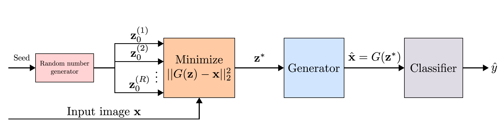
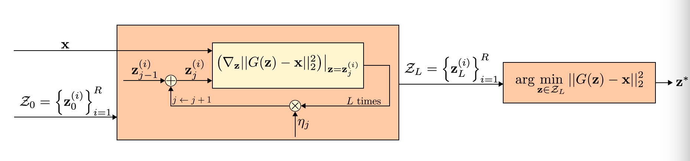

# Defense-GAN: Protecting Classifiers Against Adversarial Attacks Using Generative Models

Pouya Samangouei*, Maya Kabkab*, Rama Chellappa

[*: authors contributed equally]

This repository contains the implementation of our ICLR-18 paper:
[**Defense-GAN: Protecting Classifiers Against Adversarial Attacks Using Generative Models**](https://openreview.net/pdf?id=BkJ3ibb0-)

If you find this code or the paper useful, please consider citing:

```
@inproceedings{defensegan,
  title={Defense-GAN: Protecting classifiers against adversarial attacks using generative models},
  author={Samangouei, Pouya and Kabkab, Maya and Chellappa, Rama},
  booktitle={International Conference on Learning Representations},
  year={2018}
}
```





## Contents

1. [Installation](#installation)
2. [Usage](#usage)
    - [Train a GAN model](#train-a-gan-model)
    - [Black-box attacks](#black-box-attacks)
    - [White-box attacks](#white-box-attacks)


## Installation
1. Clone this repository:
```
git clone --recursive https://github.com/kabkabm/defensegan
cd defensegan
git submodule update --init --recursive
```

2. Install requirements:
```
pip install -r requirements.txt
```
Note: if you don't have a GPU install the cpu version of TensorFlow 1.7.

3. Download the dataset and prepare `data` directory:
```
python download_dataset.py [mnist|f-mnist|celeba]
```

4. Create or link `output` and `debug` directories:
```
mkdir output
mkdir debug
```
or
```
ln -s <path-to-output> output
ln -s <path-to-debug> debug
```


## Usage

### Train a GAN model
```
python train.py --cfg <path> --is_train <extra-args>
```
- `--cfg` This can be set to either a `.yml` configuration file like the ones in
`experiments/cfgs`, or an output directory path.
- `<extra-args>` can be any parameter that is defined in the config file.

The training will create a directory in the `output` directory per experiment
with the same name as <cfgs> to save the model checkpoints. If
`<extra-args>` are different from the ones that are defined in `<config>`,
the output directory name will reflect the difference.

A config file is saved into each experiment directory so that they can be
loaded if `<path>` is the address to that directory.

#### Example

After running
```
python train.py --cfg experiments/cfgs/gans/mnist.yml --is_train
```
`output/gans/mnist` will be created.

####  [optional] Save reconstructions and datasets into cache:
```
python train.py --cfg experiments/cfgs/<config> --save_recs
python train.py --cfg experiments/cfgs/<config> --save_ds
```

#### Example
After running the training code for `mnist`, the reconstructions and the
dataset can be saved with:
```
python train.py --cfg output/gans/mnist --save_recs
python train.py --cfg output/gans/mnist --save_ds
```

As training goes on, sample outputs of the generator are written to `debug/gans/<model_config>`.

### Black-box attacks

To perform black-box experiments run `blackbox.py` [Table 1 and 2 of the
paper]:
```
python blackbox.py --cfg <path> \
    --results_dir <results_path> \
    --bb_model {A, B, C, D, E} \
    --sub_model {A, B, C, D, E} \
    --fgsm_eps <epsilon> \
    --defense_type {none|defense_gan|adv_tr}
    [--train_on_recs or --online_training]
    <optional-arguments>
```
- `--cfg` is the path to the config file for training the iWGAN. This can
also be the path to the output directory of the model.
- `--results_dir` The path where the final results are saved in text files.
- `--bb_model` The black-box model architectures that are used in Table 1 and
Table 2.
- `--sub_model` The substitute model architectures that are used in Table 1 and
 Table 2.
- `--defense_type` specifies the type of defense to protect the classifier.
- `--train_on_recs or --online_training` These parameters are optional. If they
 are set, the classifier will be trained on the reconstructions of
 Defense-GAN (e.g. in column `Defense-GAN-Rec` of Table 1 and 2). Otherwise, the
 results are for `Defense-GAN-Orig`. Note `--online_training` will take
 a while if `--rec_iters`, or L in the paper, is set to a large value.
- `<optional-arguments>` A list of `--<arg_name> <arg_val>` that are the same
as the hyperparemeters that are defined in config files (all lower case), and
also a list of flags in `blackbox.py`. The most important ones are:
    - `--rec_iters` The number of GD reconstruction iterations for Defense-GAN, or L in
     the paper.
    - `--rec_lr` The learning rate of the reconstruction step.
    - `--rec_rr` The number of random restarts for the reconstruction step, or
    R in the paper.
    - `--num_train` The number of images to train the black-box model on. For debugging
    purposes set this to a small value.
    - `--num_test` The number of images to test on. For debugging purposes set this
    to a small value.
    - `--debug` This will save qualitative attack and reconstruction results in
     `debug` directory and will not run the adversarial attack part of the code.

- Refer to `blackbox.py` for more flag descriptions.

#### Example

- Row 1 of Table 1 `Defense-GAN-Orig`:
```
python blackbox.py --cfg output/gans/mnist \
    --results_dir defensegan \
    --bb_model A \
    --sub_model B \
    --fgsm_eps 0.3 \
    --defense_type defense_gan
```
- If you set `--nb_epochs 1 --nb_epochs_s 1 --data_aug 1` you will get a quick glance of how the script works.

### White-box attacks

To test Defense-GAN for white-box attacks run `whitebox.py` [Tables 4, 5, 12
of the paper]:
```
python whitebox.py --cfg <path> \
       --results_dir <results-dir> \
       --attack_type {fgsm, rand_fgsm, cw} \
       --defense_type {none|defense_gan|adv_tr} \
       --model {A, B, C, D} \
       [--train_on_recs or --online_training]
       <optional-arguments>
```
- `--cfg` is the path to the config file for training the iWGAN. This can
also be the path to the output directory of the model.
- `--results_dir` The path where the final results are saved in text files.
- `--defense_type` specifies the type of defense to protect the classifier.
- `--train_on_recs or --online_training` These parameters are optional. If they
 are set, the classifier will be trained on the reconstructions of
 Defense-GAN (e.g. in column `Defense-GAN-Rec` of Table 1 and 2). Otherwise, the
 results are for `Defense-GAN-Orig`. Note `--online_training` will take
 a while if `--rec_iters`, or L in the paper, is set to a large value.
- `<optional-arguments>` A list of `--<arg_name> <arg_val>` that are the same
as the hyperparemeters that are defined in config files (all lower case), and
also a list of flags in `whitebox.py`. The most important ones are:
    - `--rec_iters` The number of GD reconstruction iterations for Defense-GAN, or L in
     the paper.
    - `--rec_lr` The learning rate of the reconstruction step.
    - `--rec_rr` The number of random restarts for the reconstruction step, or
    R in the paper.
    - `--num_test` The number of images to test on. For debugging purposes set this
    to a small value.
- Refer to `whitebox.py` for more flag descriptions.

#### Example

First row of Table 4:
```
python whitebox.py --cfg <path> \
       --results_dir whitebox \
       --attack_type fgsm \
       --defense_type defense_gan \
       --model A
```
- If you want to quickly see how the scripts work, add the following flags:
```
--nb_epochs 1 --num_tests 400
```
